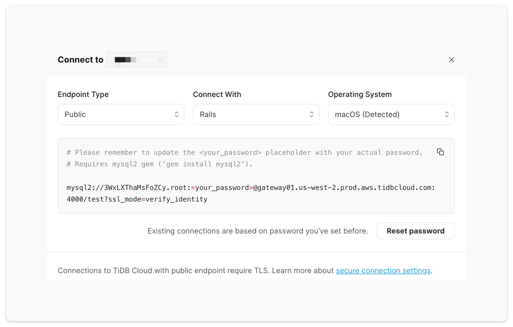

# 使用 Rails 连接 TiDB 集群

[](https://www.ruby-lang.org/en/)

以下指南将展示如何使用 [Rails](https://github.com/rails/rails) 框架连接到 TiDB 集群，并使用 ActiveRecord ORM 执行基本的 SQL 操作，如创建、读取、更新和删除。

> **注意：**
>
> TiDB 是一个与 MySQL 兼容的数据库，这意味着你可以使用来自 MySQL 生态系统的熟悉的驱动器/ORM 框架在你的应用程序中连接到一个 TiDB 集群。
>
> 唯一的区别是，如果你连接到一个使用公共端点的 TiDB Serverless 集群，你 **必须** 在 mysql2 驱动器上[启用 TLS 连接](#connect-to-tidb-cluster)。

## 先决条件

要完成本指南，你需要：

- 在你的机器上安装 [Ruby](https://www.ruby-lang.org/en/) >= 3.0
- 在你的机器上安装 [Bundler](https://bundler.io/)
- 在你的机器上安装 [Git](https://git-scm.com/downloads)
- 一个正在运行的 TiDB 集群

**如果你还没有一个 TiDB 集群，请使用其中一种以下方法创建一个：**

1. (**推荐**) 在 TiDB Cloud 中只需要几次点击，即可[启动一个 TiDB Serverless 集群](https://tidbcloud.com/free-trial?utm_source=github&utm_medium=quickstart)。
2. 在你的本地机器上使用 TiUP CLI [启动一个 TiDB Playground 集群](https://docs.pingcap.com/tidb/stable/quick-start-with-tidb#deploy-a-local-test-cluster)。

## 开始使用

本节演示如何运行示例应用的代码，以及如何使用 Rails 框架和 ActiveRecord ORM 连接到 TiDB。

### 1. 克隆仓库

运行以下命令，在本地克隆示例代码：

```shell
git clone https://github.com/tidb-samples/tidb-ruby-rails-quickstart.git
cd tidb-ruby-rails-quickstart
```

### 2. 安装依赖

运行以下命令，安装示例代码所需的依赖：

```shell
bundle install
```

<details>
<summary><b>在现有项目中安装依赖</b></summary>

对于你的现有 Rails 项目，运行以下命令安装包：

- `mysql2`：Ruby 的 MySQL 驱动，用于数据库连接和 SQL 操作。
- `dotenv-rails`：工具包，用于从 `.env` 文件加载环境变量。

```shell
bundle add mysql2 dotenv-rails
```

并更改 config/database.yml 如下：

```yaml
default: &default
  adapter: mysql2
  encoding: utf8mb4
  pool: <%= ENV.fetch("RAILS_MAX_THREADS") { 5 } %>
  url: <%= ENV["DATABASE_URL"] %>

development:
  <<: *default

test:
  <<: *default
  database: quickstart_test

production:
  <<: *default
```
</details>

### 3. 获取连接参数

<details open>
<summary><b>(选项 1) TiDB Serverless</b></summary>

你可以通过以下步骤在 [TiDB Cloud 的 Web 控制台](https://tidbcloud.com/free-trial?utm_source=github&utm_medium=quickstart)上获取数据库连接参数：

1. 导航到 [集群](https://tidbcloud.com/console/clusters) 页面，然后点击目标集群的名称，转到其概述页面。
2. 在右上角点击 **连接**。
3. 在连接对话框中，从 **连接方式** 下拉菜单中选择 `Rails`，并将 **端点类型** 的默认设置保持为 `Public`。
4. 如果你还没有设置密码，点击 **创建密码** 以生成随机密码。
5. 复制代码块中显示的连接参数。

    <div align="center">
        <picture>
            <source media="(prefers-color-scheme: dark)" srcset="./static/images/tidb-cloud-connect-dialog-dark-theme.png" width="600">
            
        </picture>
        <div><i>此为 TiDB Serverless 的连接对话框</i></div>
    </div>

</details>

<details>
<summary><b>(选项 2) TiDB Dedicated</b></summary>

你可以通过以下步骤在 [TiDB Cloud 的 Web 控制台](https://tidbcloud.com/console)上获取数据库连接参数：

1. 转到 [集群](https://tidbcloud.com/console/clusters) 页面，然后点击目标集群的名称转到其概述页面。
2. 在右上角点击 **连接**，将显示连接对话框。
3. 为集群创建一个流量过滤器。

   1. 点击 **允许从任何地方访问**，添加一个新的 CIDR 地址规则，允许来自任何 IP 地址的客户端访问。
   2. 点击 **创建过滤器** 来确认更改。

4. 在对话框的 **步骤2：下载 TiDB 集群 CA** 下，点击 **下载 TiDB 集群 CA**，用于连接到 TiDB 集群的 TLS 连接。
5. 在对话框的 **步骤3：使用 SQL 客户端连接** 下，从 **连接方式** 下拉菜单中选择 `Rails`，并从 **端点类型** 下拉菜单中选择 `Public`。
6. 复制代码块中显示的连接参数。

</details>

<details>
<summary><b>(选项 3) TiDB 自托管</b></summary>

   准备集群的以下连接参数：

  - **host**：运行 TiDB 集群的 IP 地址或域名（例如：`127.0.0.1`）。
  - **port**：数据库服务器运行的端口（默认：`4000`）。
  - **user**：数据库用户名（默认：`root`）。
  - **password**：数据库用户的密码（TiDB Playground 默认无密码）。

</details>

### 4. 设置环境变量

<details open>
   <summary><b>(选项 1) TiDB Serverless</b></summary>

   1. 复制 `.env.example` 文件为 `.env` 文件。
   2. 编辑 `.env` 文件，将 `DATABASE_URL` 的占位符替换为复制的连接参数。
   3. 在 `DATABASE_URL` 中修改 `ssl_mode` 查询参数值，将其设为 `verify_identity` 以启用 TLS 连接。（公共端点必须）

   ```dotenv
   DATABASE_URL=mysql2://<user>:<password>@<host>:<port>/<database>?ssl_mode=verify_identity
   ```

</details>

<details>
   <summary><b>(选项 2) TiDB Dedicated</b></summary>

   1. 复制 `.env.example` 文件为 `.env` 文件。
   2. 编辑 `.env` 文件，将 `DATABASE_URL` 的占位符替换为复制的连接参数。
   3. 在 `DATABASE_URL` 中修改 `ssl_mode` 查询参数值，将其设为 `verify_identity` 以启用 TLS 连接。（公共端点必须）
   4. 将 `sslca` 修改为 TiDB Cloud 提供的 CA 证书的文件路径。（公共端点必须）

   ```dotenv
   DATABASE_URL=mysql2://<user>:<password>@<host>:<port>/<database>?ssl_mode=verify_identity&sslca=/path/to/ca.pem
   ```

</details>

<details>
   <summary><b>(选项 3) TiDB Self-Hosted</b></summary>

   1. 复制 `.env.example` 文件为 `.env` 文件。
   2. 编辑 `.env` 文件，将 `DATABASE_URL` 的占位符替换为复制的连接参数。

   > 默认情况下，TiDB Self-Hosted 集群在 TiDB's 服务器和客户端之间使用非加密连接，如果你的集群没有[启用 TLS 连接](https://docs.pingcap.com/tidb/stable/enable-tls-between-clients-and-servers#configure-tidb-server-to-use-secure-connections)，请跳过以下步骤。

   3. （可选）在 `DATABASE_URL` 中修改 `ssl_mode` 查询参数值以启用 TLS 连接。
   4. （可选）将 `sslca` 修改为由 [`ssl-ca`](https://docs.pingcap.com/tidb/stable/tidb-configuration-file#ssl-ca) 选项定义的受信任的 CA 证书的文件路径。

   

   ```dotenv
   DATABASE_URL=mysql2://<user>:<password>@<host>:<port>/<database>
   ```

</details>

### 5. 运行示例代码

1. 创建数据库和表：

```shell
bundle exec rails db:create
bundle exec rails db:migrate
```

2. 添加示例数据：

```shell
bundle exec rails db:seed
```

3. 运行以下命令执行示例代码：

```shell
bundle exec rails runner ./quickstart.rb
```

如果连接成功，控制台将输出 TiDB 集群的版本。

**预期的执行输出：**

```
🆕 Created a new player with ID 12.
ℹ️ Got Player 12: Player { id: 12, coins: 100, goods: 100 }
🔢 Added 50 coins and 50 goods to player 12, updated 1 row.
🚮 Deleted 1 player data.
```

## 示例代码

### 连接到 TiDB 集群

以下代码使用环境变量（存储在 `.env` 文件中）作为连接选项，与 TiDB 集群建立数据库连接：


```yaml
default: &default
  adapter: mysql2
  encoding: utf8mb4
  pool: <%= ENV.fetch("RAILS_MAX_THREADS") { 5 } %>
  url: <%= ENV["DATABASE_URL"] %>

development:
  <<: *default

test:
  <<: *default
  database: quickstart_test

production:
  <<: *default
```


<details open>
   <summary><b>链接到 TiDB Serverless</b></summary>

要与公共端点的 **TiDB Serverless** 建立连接，请将 `DATABASE_URL` 中的 `ssl_mode` 查询参数值设置为 `verify_identity` 以启用 TLS 连接。

默认情况下，mysql2 gem 将按特定顺序搜索现有的 CA 证书，直到发现文件。

1. /etc/ssl/certs/ca-certificates.crt # Debian / Ubuntu / Gentoo / Arch / Slackware
2. /etc/pki/tls/certs/ca-bundle.crt # RedHat / Fedora / CentOS / Mageia / Vercel / Netlify
3. /etc/ssl/ca-bundle.pem # OpenSUSE
4. /etc/ssl/cert.pem # MacOS / Alpine（docker 容器）

尽管可以手动指定 CA 证书路径，但在多环境部署场景中，这种方法可能会造成很大的不便，因为不同的机器和环境可能会在不同的位置存储 CA 证书。因此，建议将 `sslca` 设置为 `nil`，以提高灵活性，并方便在不同环境中进行部署。

</details>

<details>
   <summary><b>链接到 TiDB Dedicated</b></summary>

要与公共端点的 **TiDB Dedicated** 建立连接，请将 `DATABASE_URL` 中的 `ssl_mode` 查询参数值设置为 `verify_identity` 以启用 TLS 连接，并设置 `sslca` 查询参数值为从 [TiDB Cloud Web 控制台](#3-obtain-connection-parameters) 下载的 CA 证书的文件路径。

</details>


### 5. 运行示例代码

1. 创建数据库和表：

```shell
bundle exec rails db:create
bundle exec rails db:migrate
```

2. 添加示例数据：

```shell
bundle exec rails db:seed
```

3. 运行以下命令执行示例代码：

```shell
bundle exec rails runner ./quickstart.rb
```

如果连接成功，控制台将输出 TiDB 集群的版本。

**预期的执行输出：**

```
🆕 Created a new player with ID 12.
ℹ️ Got Player 12: Player { id: 12, coins: 100, goods: 100 }
🔢 Added 50 coins and 50 goods to player 12, updated 1 row.
🚮 Deleted 1 player data.
```

## 示例代码

### 连接到 TiDB 集群

以下代码使用环境变量（存储在 `.env` 文件中）作为连接选项，与 TiDB 集群建立数据库连接：


```yaml
default: &default
  adapter: mysql2
  encoding: utf8mb4
  pool: <%= ENV.fetch("RAILS_MAX_THREADS") { 5 } %>
  url: <%= ENV["DATABASE_URL"] %>

development:
  <<: *default

test:
  <<: *default
  database: quickstart_test

production:
  <<: *default
```


<details open>
   <summary><b>链接到 TiDB Serverless</b></summary>

要与公共端点的 **TiDB Serverless** 建立连接，请将 `DATABASE_URL` 中的 `ssl_mode` 查询参数值设置为 `verify_identity` 以启用 TLS 连接。

默认情况下，mysql2 gem 将按特定顺序搜索现有的 CA 证书，直到发现文件。

1. /etc/ssl/certs/ca-certificates.crt # Debian / Ubuntu / Gentoo / Arch / Slackware
2. /etc/pki/tls/certs/ca-bundle.crt # RedHat / Fedora / CentOS / Mageia / Vercel / Netlify
3. /etc/ssl/ca-bundle.pem # OpenSUSE
4. /etc/ssl/cert.pem # MacOS / Alpine（docker 容器）

尽管可以手动指定 CA 证书路径，但在多环境部署场景中，这种方法可能会造成很大的不便，因为不同的机器和环境可能会在不同的位置存储 CA 证书。因此，建议将 `sslca` 设置为 `nil`，以提高灵活性，并方便在不同环境中进行部署。

</details>

<details>
   <summary><b>链接到 TiDB Dedicated</b></summary>

要与公共端点的 **TiDB Dedicated** 建立连接，请将 `DATABASE_URL` 中的 `ssl_mode` 查询参数值设置为 `verify_identity` 以启用 TLS 连接，并设置 `sslca` 查询参数值为从 [TiDB Cloud Web 控制台](#3-obtain-connection-parameters) 下载的 CA 证书的文件路径。

</details>

### 插入数据

以下查询创建了一个具有两个字段的 Player，并返回 Player 对象：

```ruby
new_player = Player.create!(coins: 100, goods: 100)
```

更多信息，请参考 [插入数据](https://docs.pingcap.com/tidbcloud/dev-guide-insert-data)。

### 查询数据

以下查询通过 ID 返回单个 `Player` 记录：

```ruby
player = Player.find_by(id: new_player.id)
```

更多信息，请参考 [查询数据](https://docs.pingcap.com/tidbcloud/dev-guide-get-data-from-single-table)。

### 更新数据

以下查询更新了单个 `Player` 对象：

```ruby
player.update(coins: 50, goods: 50)
```

更多信息，请参考 [更新数据](https://docs.pingcap.com/tidbcloud/dev-guide-update-data)。

### 删除数据

以下查询删除了单个 `Player` 记录：

```ruby
player.destroy
```

更多信息，请参考 [删除数据](https://docs.pingcap.com/tidbcloud/dev-guide-delete-data)。

## 下一步

- 在 [TiDB Cloud Playground](https://play.tidbcloud.com/real-time-analytics) 上探索实时分析功能。
- 阅读 [TiDB 开发者指南](https://docs.pingcap.com/tidbcloud/dev-guide-overview)，了解更多关于使用 TiDB 进行应用开发的详细信息。
  - [HTAP 查询](https://docs.pingcap.com/tidbcloud/dev-guide-hybrid-oltp-and-olap-queries)
  - [事务](https://docs.pingcap.com/tidbcloud/dev-guide-transaction-overview)
  - [优化 SQL 性能](https://docs.pingcap.com/tidbcloud/dev-guide-optimize-sql-overview)