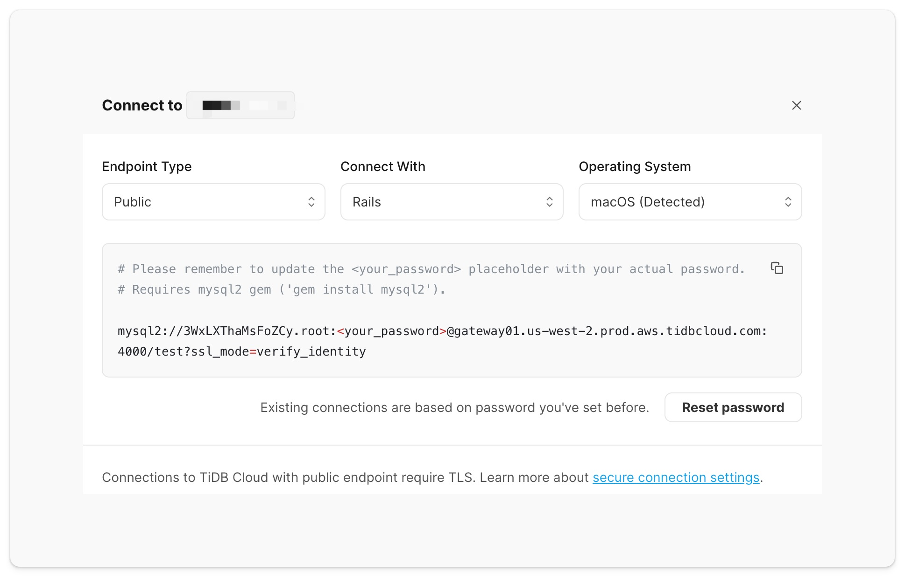

# Connecting to TiDB cluster with Rails

[](https://www.ruby-lang.org/en/)

The following guide will show you how to connect to the TiDB cluster with [Rails](https://github.com/rails/rails) framework and perform basic SQL operations like create, read, update, and delete using ActiveRecord ORM.

> **Notice:**
>
> TiDB is a MySQL-compatible database, which means you can connect to a TiDB cluster in your application using the familiar driver/ORM framework from the MySQL ecosystem.
>
> The only difference is that if you connect to a TiDB Serverless cluster with public endpoint, you **MUST** [enable TLS connection on the mysql2 driver](#connect-to-tidb-cluster).

## Prerequisites

To complete this guide, you need:

- [Ruby](https://www.ruby-lang.org/en/) >= 3.0 installed on your machine
- [Bundler](https://bundler.io/) installed on your machine
- [Git](https://git-scm.com/downloads) installed on your machine
- A TiDB cluster running

**If you don't have a TiDB cluster yet, please create one with one of the following methods:**

1. (**Recommend**) [Start up a TiDB Serverless cluster](https://tidbcloud.com/free-trial?utm_source=github&utm_medium=quickstart) instantly with a few clicks on TiDB Cloud.
2. [Start up a TiDB Playground cluster](https://docs.pingcap.com/tidb/stable/quick-start-with-tidb#deploy-a-local-test-cluster) with TiUP CLI on your local machine.

## Getting Started

This section demonstrates how to run the sample application code and connect to TiDB with Rails framework and ActiveRecord ORM.

### 1. Clone the repository

Run the following command to clone the sample code locally：

```shell
git clone https://github.com/tidb-samples/tidb-ruby-rails-quickstart.git
cd tidb-ruby-rails-quickstart
```

### 2. Install dependencies

Run the following command to install the dependencies required by the sample code：

```shell
bundle install
```

<details>
<summary><b>Install dependencies to existing project</b></summary>

For your existing rails project, run the following command to install the packages:

- `mysql2`: The ruby MySQL driver for the database connection and SQL operations.
- `dotenv-rails`: The utils package to loading environment variables from the `.env` file.

```shell
bundle add mysql2 dotenv-rails
```

and change config/database.yml like this:

```yaml
default: &default
  adapter: mysql2
  encoding: utf8mb4
  pool: <%= ENV.fetch("RAILS_MAX_THREADS") { 5 } %>
  url: <%= ENV["DATABASE_URL"] %>

development:
  <<: *default

test:
  <<: *default
  database: quickstart_test

production:
  <<: *default
```
</details>


### 3. Obtain connection parameters

<details open>
<summary><b>(Option 1) TiDB Serverless</b></summary>

You can obtain the database connection parameters on [TiDB Cloud's Web Console](https://tidbcloud.com/free-trial?utm_source=github&utm_medium=quickstart) through the following steps:

1. Navigate to the [Clusters](https://tidbcloud.com/console/clusters) page, and then click the name of your target cluster to go to its overview page.
2. Click **Connect** in the upper-right corner.
3. In the connection dialog, select `Rails` from the **Connect With** dropdown and keep the default setting of the **Endpoint Type** as `Public`.
4. If you have not set a password yet, click **Create password** to generate a random password.
5. Copy the connection parameters shown on the code block.

    <div align="center">
        <picture>
            <source media="(prefers-color-scheme: dark)" srcset="./static/images/tidb-cloud-connect-dialog-dark-theme.png" width="600">
            
        </picture>
        <div><i>The connection dialog of TiDB Serverless</i></div>
    </div>

</details>

<details>
<summary><b>(Option 2) TiDB Dedicated</b></summary>

You can obtain the database connection parameters on [TiDB Cloud's Web Console](https://tidbcloud.com/console) through the following steps:

1. Navigate to the [Clusters](https://tidbcloud.com/console/clusters) page, and then click the name of your target cluster to go to its overview page.
2. Click **Connect** in the upper-right corner. A connection dialog is displayed.
3. Create a traffic filter for the cluster.

   1. Click **Allow Access from Anywhere** to add a new CIDR address rule to allow clients from any IP address to access. 
   2. Click **Create Filter** to confirm the changes.

4. Under **Step 2: Download TiDB cluster CA** in the dialog, click **Download TiDB cluster CA** for TLS connection to TiDB clusters.
5. Under **Step 3: Connect with a SQL client** in the dialog, select `Rails` from the **Connect With** dropdown and select `Public` from the **Endpoint Type** dropdown.
6. Copy the connection parameters shown on the code block.

</details>

<details>
<summary><b>(Option 3) TiDB Self-Hosted</b></summary>

   Prepare the following connection parameters for your cluster:

  - **host**: The IP address or domain name where the TiDB cluster running (For example: `127.0.0.1`).
  - **port**: The port on which your database server is running (Default: `4000`).
  - **user**: The name of your database user (Default: `root`).
  - **password**: The password of your database user (No password for TiDB Playground by default).

</details>

### 4. Set up the environment variables

<details open>
   <summary><b>(Option 1) TiDB Serverless</b></summary>

   1. Make a copy of the `.env.example` file to the `.env` file.
   2. Edit the `.env` file, and replace the placeholders for `DATABASE_URL` with the copied connection parameters.
   3. Modify `ssl_mode` query parameter value in `DATABASE_URL` to `verify_identity` to enable a TLS connection. (Required for public endpoint)

   ```dotenv
   DATABASE_URL=mysql2://<user>:<password>@<host>:<port>/<database>?ssl_mode=verify_identity
   ```

</details>

<details>
   <summary><b>(Option 2) TiDB Dedicated</b></summary>

   1. Make a copy of the `.env.example` file to the `.env` file.
   2. Edit the `.env` file, and replace the placeholders for `DATABASE_URL` with the copied connection parameters.
   3. Modify `ssl_mode` query parameter value in `DATABASE_URL` to `verify_identity` to enable a TLS connection. (Required for public endpoint)
   4. Modify `sslca` to the file path of the CA certificate provided by TiDB Cloud. (Required for public endpoint)

   ```dotenv
   DATABASE_URL=mysql2://<user>:<password>@<host>:<port>/<database>?ssl_mode=verify_identity&sslca=/path/to/ca.pem
   ```

</details>

<details>
   <summary><b>(Option 3) TiDB Self-Hosted</b></summary>

   1. Make a copy of the `.env.example` file to the `.env` file.
   2. Edit the `.env` file, and replace the placeholders for `DATABASE_URL` with the copied connection parameters.

   > The TiDB Self-Hosted cluster using non-encrypted connection between TiDB's server and clients by default, SKIP the below steps if your cluster doesn't [enable TLS connections](https://docs.pingcap.com/tidb/stable/enable-tls-between-clients-and-servers#configure-tidb-server-to-use-secure-connections).

   3. (Optional) Modify `ssl_mode` query parameter value in `DATABASE_URL` to enable a TLS connection.
   4. (Optional) Modify `sslca` to the file path of the trusted CA certificate defined with [`ssl-ca`](https://docs.pingcap.com/tidb/stable/tidb-configuration-file#ssl-ca) option.

   

   ```dotenv
   DATABASE_URL=mysql2://<user>:<password>@<host>:<port>/<database>
   ```

</details>

### 5. Run the sample code

1. Create the database and table:

```shell
bundle exec rails db:create
bundle exec rails db:migrate
```

2. Seed the sample data:

```shell
bundle exec rails db:seed
```

3. Run the following command to execute the sample code:

```shell
bundle exec rails runner ./quickstart.rb
```

If the connection is successful, the console will output the version of the TiDB cluster.

**Expected execution output:**

```
🆕 Created a new player with ID 12.
ℹ️ Got Player 12: Player { id: 12, coins: 100, goods: 100 }
🔢 Added 50 coins and 50 goods to player 12, updated 1 row.
🚮 Deleted 1 player data.
```

## Example codes

### Connect to TiDB cluster

The following code use the environment variables (stored in the `.env` file) as the connection options to establish a database connection with the TiDB cluster:


```yaml
default: &default
  adapter: mysql2
  encoding: utf8mb4
  pool: <%= ENV.fetch("RAILS_MAX_THREADS") { 5 } %>
  url: <%= ENV["DATABASE_URL"] %>

development:
  <<: *default

test:
  <<: *default
  database: quickstart_test

production:
  <<: *default
```


<details open>
   <summary><b>For TiDB Serverless</b></summary>

To connect **TiDB Serverless** with the public endpoint, please set up the `ssl_mode` query parameter value in `DATABASE_URL` to `verify_identity` to enable TLS connection.

By default, the mysql2 gem will search for existing CA certificates in a particular order until a file is discovered.

1. /etc/ssl/certs/ca-certificates.crt # Debian / Ubuntu / Gentoo / Arch / Slackware
2. /etc/pki/tls/certs/ca-bundle.crt # RedHat / Fedora / CentOS / Mageia / Vercel / Netlify
3. /etc/ssl/ca-bundle.pem # OpenSUSE
4. /etc/ssl/cert.pem # MacOS / Alpine (docker container)

While it is possible to specify the CA certificate path manually, this approach may cause significant inconvenience in multi-environment deployment scenarios, as different machines and environments may store the CA certificate in varying locations. Therefore, setting `sslca` to `nil` is recommended for flexibility and ease of deployment across different environments.

</details>

<details>
   <summary><b>For TiDB Dedicated</b></summary>

To connect **TiDB Dedicated** with the public endpoint, please set up the `ssl_mode` query parameter value in `DATABASE_URL` to `verify_identity` to enable TLS connection and set up the `sslca` query parameter value to the file path of CA certificate downloaded from [TiDB Cloud Web Console](#3-obtain-connection-parameters).

</details>

### Insert data

The following query creates a single Player with two fields and return the Player object:

```ruby
new_player = Player.create!(coins: 100, goods: 100)
```

For more information, refer to [Insert Data](https://docs.pingcap.com/tidbcloud/dev-guide-insert-data).

### Query data

The following query returns a single `Player` record by ID:

```ruby
player = Player.find_by(id: new_player.id)
```

For more information, refer to [Query Data](https://docs.pingcap.com/tidbcloud/dev-guide-get-data-from-single-table).

### Update data

The following query updated a single `Player` object:

```ruby
player.update(coins: 50, goods: 50)
```

For more information, refer to [Update Data](https://docs.pingcap.com/tidbcloud/dev-guide-update-data).

### Delete data

The following query deletes a single `Player` record:

```ruby
player.destroy
```

For more information, refer to [Delete Data](https://docs.pingcap.com/tidbcloud/dev-guide-delete-data).


## What's next

- Explore the real-time analytics feature on the [TiDB Cloud Playground](https://play.tidbcloud.com/real-time-analytics).
- Read the [TiDB Developer Guide](https://docs.pingcap.com/tidbcloud/dev-guide-overview) to learn more details about application development with TiDB.
  - [HTAP Queries](https://docs.pingcap.com/tidbcloud/dev-guide-hybrid-oltp-and-olap-queries)
  - [Transaction](https://docs.pingcap.com/tidbcloud/dev-guide-transaction-overview)
  - [Optimizing SQL Performance](https://docs.pingcap.com/tidbcloud/dev-guide-optimize-sql-overview)
